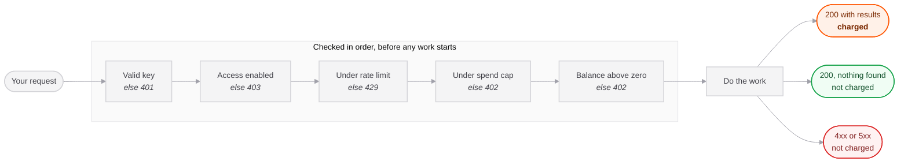

## Prepaid balance

The API draws down a prepaid dollar balance. There is no monthly commitment and credit does not expire.

Dollars rather than an invented credit unit, so you can multiply a price by your expected volume without first learning our exchange rate.

## Prices

| Endpoint | Price per call |
|---|---|
| `/v1/assist` | **$0.01** |
| `/v1/scan` | **$0.15** |
| `/v1/playbook` | **$0.20** |
| `/v1/music` | **$0.25** |

Prices are the same on TikTok and Douyin, even though Douyin costs us more to serve.

## When a call is charged

Every gate runs before any work starts, so a request that cannot be served is
refused rather than served and billed.



Every red outcome above costs **nothing**. So does the empty one.

## What is never charged

- **Failed calls.** Any 4xx or 5xx bills nothing.
- **Empty results.** A scan that finds no reels, or a music request that finds no usable sound, returns `200` with an empty array and `x-nouvel-charged-usd: 0`. Finding nothing is a real answer, not a fault.
- **Idempotent replays.** A repeated `Idempotency-Key` returns the original outcome free.

## Partial delivery is charged pro rata

`/v1/scan` bills by what it actually delivered, against a full delivery of 20 reels:

```
charge = $0.15 × (reels delivered ÷ 20)
```

A scan returning 12 reels costs $0.09. Asking for `limit: 5` and getting 5 costs $0.0375.

The other three endpoints are flat: they either produce the artifact or they fail and cost nothing.

<Note>
On `/v1/music`, `limit` changes how many suggestions come back and **nothing about the price**. The cost is set by how many sounds we have to listen to and judge, which is fixed. Asking for 3 costs the same as asking for 20.
</Note>

## Response headers

Every successful call reports the charge and what is left:

| Header | Meaning |
|---|---|
| `x-nouvel-charged-usd` | Charged for this call, to 6 decimal places |
| `x-nouvel-balance-usd` | Balance remaining after it |
| `x-nouvel-idempotent-replay` | Present and `true` only on a replay |

## Credit packs

| Pack | Pay | Credit | Bonus |
|---|---|---|---|
| Starter | $100 | $100 | none |
| Growth | $500 | $550 | +10% |
| Scale | $2,000 | $2,400 | +20% |

Volume arrives as bonus credit rather than a second rate card, so the price list stays one column and support never has to work out which rate applied to which historical call.

## Running out

At a zero balance the next call returns `402 insufficient_credit`. A call that lands at exactly zero still completes; it is the following one that is refused, so a scan never dies halfway through work already paid for upstream.

### Auto recharge

Turn it on in **Settings → API** to top up automatically when the balance falls below a threshold you set. It charges the card saved on your last purchase.

<Warning>
If an automatic top-up is declined, auto recharge **pauses** rather than retrying. Repeated attempts on a failing card get a merchant flagged by the issuer. Buy credit once with a working card to resume.
</Warning>

### Spend cap

Set a monthly ceiling in **Settings → API**. Once this calendar month's spend reaches it, calls return `402 spend_cap_reached` regardless of your balance.

A balance says whether you *can* pay. A cap says whether you *meant* to. The cap is the only real protection against a bug in your own loop.
