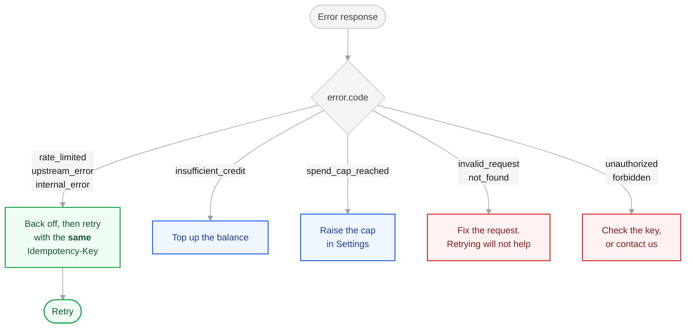

Every error returns the same shape:

```json
{
  "error": {
    "code": "insufficient_credit",
    "message": "Balance is $0.00. Top up to continue.",
    "balance_usd": 0,
    "required_usd": 0.15
  }
}
```

**Branch on `code`, never on `message`.** Codes are stable and will not change meaning. Messages are written for humans and may be reworded.

## Codes

| Code | Status | Meaning | What to do |
|---|---|---|---|
| `unauthorized` | 401 | Missing or invalid key | Check the `Authorization` header |
| `forbidden` | 403 | API access not enabled for this account | Contact us; do not retry |
| `insufficient_credit` | 402 | Balance is empty | Top up. Carries `balance_usd` and `required_usd` |
| `spend_cap_reached` | 402 | This month's cap is reached | Raise the cap. Carries `cap_usd` and `spent_usd` |
| `rate_limited` | 429 | Too many requests | Back off and retry |
| `invalid_request` | 400 | Malformed or missing parameter | Fix the request; retrying will not help |
| `not_found` | 404 | The video could not be found or has no downloadable file | Check the URL |
| `upstream_error` | 502 | A provider or model failed | Retry with backoff |
| `internal_error` | 500 | Our fault | Retry with backoff; tell us if it persists |

## Which to retry




<CodeGroup>
```typescript TypeScript
const RETRYABLE = new Set(['rate_limited', 'upstream_error', 'internal_error'])

async function call(path: string, body: unknown, attempt = 0): Promise<Response> {
  const response = await fetch(`https://nouvelhq.com/api/v1/${path}`, {
    method: 'POST',
    headers: {
      authorization: `Bearer ${process.env.NOUVEL_API_KEY}`,
      'content-type': 'application/json',
      // Same key across retries, so a call that actually succeeded
      // server-side is never charged twice.
      'idempotency-key': idempotencyKeyFor(body),
    },
    body: JSON.stringify(body),
  })
  if (response.ok || attempt >= 3) return response

  const { error } = await response.clone().json()
  if (!RETRYABLE.has(error?.code)) return response

  await new Promise((r) => setTimeout(r, 2 ** attempt * 1000))
  return call(path, body, attempt + 1)
}
```

```python Python
RETRYABLE = {"rate_limited", "upstream_error", "internal_error"}

def call(path, body, idempotency_key, attempt=0):
    response = requests.post(
        f"https://nouvelhq.com/api/v1/{path}",
        headers={
            "Authorization": f"Bearer {API_KEY}",
            # Reused across retries so a success we never saw is not billed twice.
            "Idempotency-Key": idempotency_key,
        },
        json=body,
        timeout=300,
    )
    if response.ok or attempt >= 3:
        return response
    if response.json().get("error", {}).get("code") not in RETRYABLE:
        return response
    time.sleep(2 ** attempt)
    return call(path, body, idempotency_key, attempt + 1)
```
</CodeGroup>

<Warning>
Always reuse the **same** `Idempotency-Key` across retries of one logical request. A fresh key per attempt defeats the protection and you will be charged for every attempt that quietly succeeded.
</Warning>

## Errors cost nothing

No error response is ever billed. You are only charged for work delivered.
