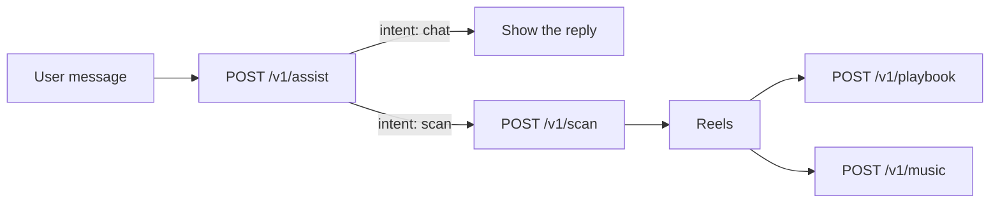

The Nouvel API gives you programmatic access to the same pipeline the Nouvel app runs on: keyword scans across TikTok and Douyin, frame-level playbooks for any reel, sound matching, and a conversational router that decides which of those a user's message actually needs.

<Note>
Access is invite-only. If your account has not been granted API access, every endpoint returns `403 forbidden`.
</Note>

## The four endpoints

<CardGroup cols={2}>
  <Card title="Assist" icon="comments" href="/api-reference/assist">
    Classify a user's message and get back the call to make. **$0.01**
  </Card>
  <Card title="Scan" icon="magnifying-glass" href="/api-reference/scan">
    Up to 20 ranked reels for one brief. **$0.15**
  </Card>
  <Card title="Playbook" icon="clapperboard" href="/api-reference/playbook">
    Frame-level breakdown of one reel, with a shot list. **$0.20**
  </Card>
  <Card title="Music" icon="music" href="/api-reference/music">
    Sound recommendations matched to one video. **$0.25**
  </Card>
</CardGroup>

## How the pieces fit

Most integrations follow one shape. A user types something, you ask Assist what it means, and Assist tells you which endpoint to call next.



**Assist never executes anything.** It returns the call it thinks you should make and stops there, so you decide whether to spend the credit. A misclassification costs you a cent, not a scan.

## Base URL

```
https://nouvelhq.com/api/v1
```

Every endpoint is `POST`, takes JSON, and returns JSON.
