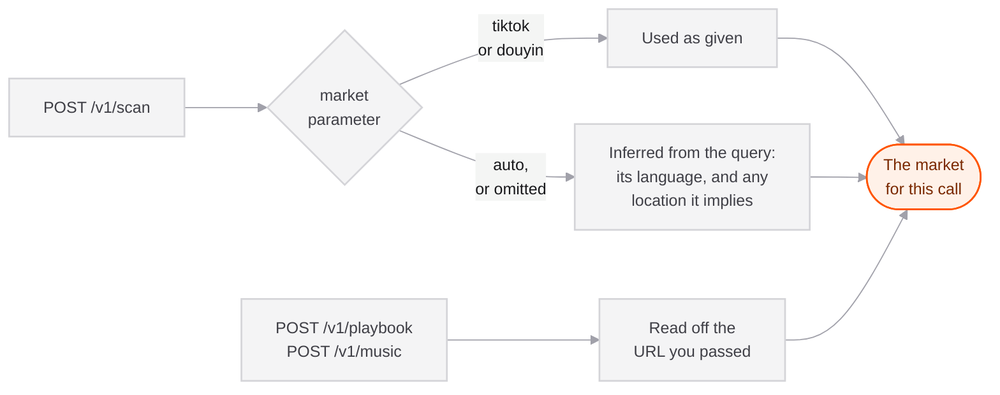

## Two networks, not one

TikTok does not operate in mainland China and Douyin does not operate outside it. They are separate apps with separate catalogues and **no shared identifiers**.

This is not a preference you tune. A reel, a creator and a sound all exist on exactly one of the two, so a result from the wrong network is not a weaker result, it is one your user physically cannot act on.

| | TikTok | Douyin |
|---|---|---|
| Market value | `tiktok` | `douyin` |
| Audience | Everywhere except mainland China | Mainland China |
| Reel URLs | `tiktok.com/@user/video/<id>` | `douyin.com/video/<id>` |
| Default playbook language | English | Simplified Chinese |

## How the market is chosen

**On `/v1/scan`**, it is inferred from your query: the language you write in, and any location the text implies. A Chinese-language brief reaches Douyin without you having to know our routing rules.

Override it when you know your customer's market better than the text does:

```json
{ "query": "健身房 增肌", "market": "douyin" }
```

Accepted values are `tiktok`, `douyin`, and `auto` (the default).



**On `/v1/playbook` and `/v1/music`**, it is read from the URL you pass. There is no parameter, because the reel itself already settles the question.

## Languages

Playbooks are written in one of three:

| Value | Script | Audience |
|---|---|---|
| `en` | English | Default for TikTok |
| `zh-Hans` | 简体中文 | Default for Douyin, mainland China |
| `zh-Hant` | 繁體中文 | Taiwan, Hong Kong, Macau |

**Douyin defaults to Simplified Chinese** because a playbook is a script your user reads aloud and captions they type for a mainland audience. Delivered in English it is homework, not a plan.

Simplified and Traditional are separate values on purpose. They are the same spoken language in two scripts, and a mainland founder handed Traditional characters reads it as a Taiwan document.

<Note>
Anyone targeting Taiwan or Hong Kong is on **TikTok**, not Douyin, so pass `zh-Hant` explicitly there.
</Note>

For convenience these aliases all resolve: `english`, `chinese`, `simplified`, `traditional`, `zh`, `zh-CN`, `zh-TW`, `zh-HK`.

## What differs on Douyin

Worth knowing when you compare results across markets:

- **Play counts arrive separately.** Douyin withholds them from every feed payload, so we fetch them from a dedicated endpoint before delivering. They are populated in the response either way.
- **Music is a different catalogue.** Douyin sound ids are namespaced `douyin:<id>` so they can never collide with a TikTok sound.
- **Fewer results per provider page**, so a Douyin scan pages deeper. It costs us more; the price to you is the same.
